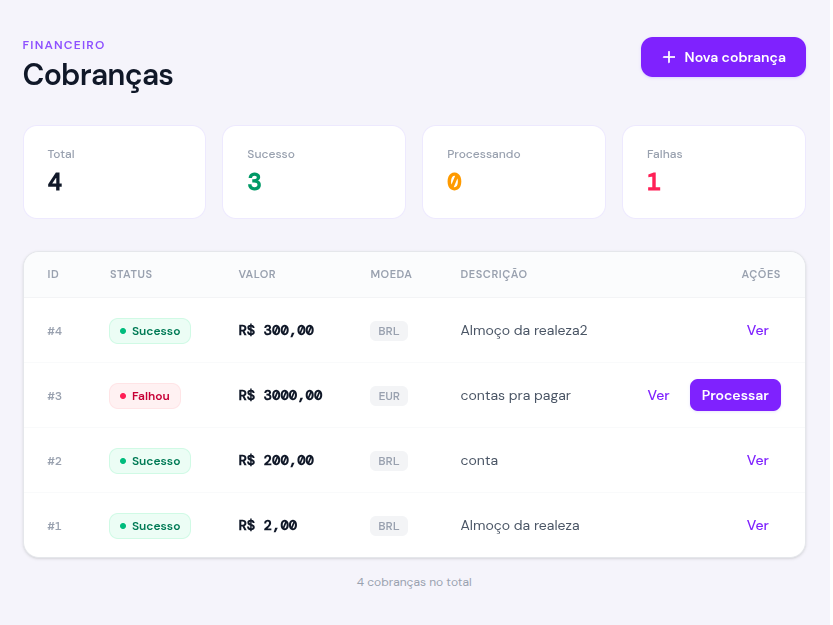
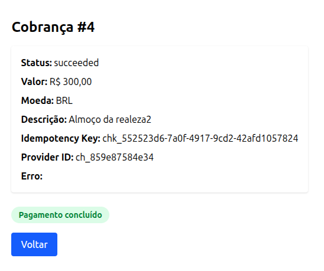
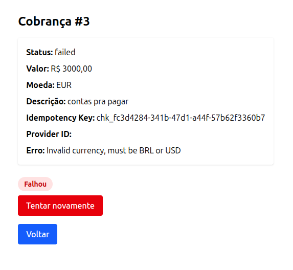

# CheckoutPay

Mini módulo de checkout/pagamentos em Ruby on Rails com criação idempotente, processamento assíncrono via Sidekiq e gateway simulado para estudo de fluxos reais de pagamento.

## Visão geral

Este projeto foi construído para simular um fluxo de pagamento mais próximo do mundo real, com foco em:

- criação idempotente de cobranças
- processamento assíncrono com Sidekiq
- tratamento de erros temporários e permanentes
- prevenção de duplicidade em cenários de concorrência
- separação clara entre Model, Service, Worker e Controller
- interface web simples para demonstração
- API JSON reutilizável

A ideia central é demonstrar como um sistema de pagamento pode ser modelado de forma segura e organizada, servindo como base para futuros projetos maiores, como um checkout real ou até uma plataforma estilo gateway de pagamentos.

---

## Funcionalidades

- criação de cobrança pela interface web
- criação de cobrança via API
- idempotency key reutilizável
- status de cobrança:
  - pending
  - processing
  - succeeded
  - failed
- processamento em background com Sidekiq
- gateway fake com simulação de:
  - sucesso
  - erro temporário
  - erro permanente
- retry automático para falhas temporárias
- bloqueio de processamento duplicado com lock no registro
- interface com Tailwind CSS
- visualização de cobranças, status e erros

---

## Screenshots

### Index


### Cobrança com sucesso


### Cobrança com falha


---

## Stack utilizada

- Ruby on Rails
- SQLite
- Sidekiq
- Redis
- Tailwind CSS

---

## Arquitetura

### Model
`Charge`

Responsável por:
- persistência da cobrança
- validações
- status
- helpers de exibição como valor formatado

### Service
`Payments::ChargeCreator`

Responsável por:
- criação idempotente da cobrança
- reaproveitamento de `idempotency_key`
- tratamento de corrida com `find_or_create_by!` + `RecordNotUnique`

### Worker
`ChargeProcessorWorker`

Responsável por:
- buscar a cobrança
- impedir reprocessamento de cobranças já concluídas
- travar concorrência com `with_lock`
- chamar o gateway
- atualizar status e provider ID
- distinguir falhas temporárias e permanentes

### Gateway
`Payments::FakeGateway`

Responsável por:
- simular um gateway externo
- retornar sucesso com `provider_charge_id`
- lançar erro temporário
- lançar erro permanente

### Controllers
- `ChargesController` → interface HTML
- `Api::ChargesController` → API JSON

---

## Conceitos demonstrados

### 1. Idempotência
A criação da cobrança usa `idempotency_key`, evitando duplicação quando o mesmo pedido é enviado mais de uma vez.

### 2. Concorrência
O projeto trata cenários em que dois processos tentam criar ou processar a mesma cobrança ao mesmo tempo.

### 3. Retry inteligente
Erros temporários voltam para `pending` e são reprocessados pelo Sidekiq. Erros permanentes encerram o fluxo com status `failed`.

### 4. Separação de responsabilidades
- Model protege o dado
- Service concentra a regra de criação
- Worker executa o processamento
- Controller apenas recebe e responde

---

## Fluxo principal

### Criação
1. usuário envia os dados da cobrança
2. o service normaliza a `idempotency_key`
3. se a cobrança já existir, ela é reutilizada
4. se não existir, é criada com status `pending`

### Processamento
1. o worker recebe `charge_id`
2. verifica se já foi concluída
3. trava a cobrança com `with_lock`
4. muda para `processing`
5. chama o gateway fake
6. se sucesso:
   - status = `succeeded`
   - salva `provider_charge_id`
7. se erro temporário:
   - status = `pending`
   - salva mensagem de erro
   - Sidekiq faz retry
8. se erro permanente:
   - status = `failed`
   - salva mensagem de erro

---

## Como rodar o projeto

### 1. Clonar o repositório
```bash
git clone <URL_DO_REPOSITORIO>
cd checkoutpay